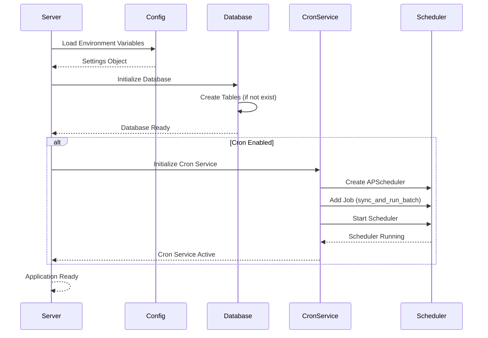
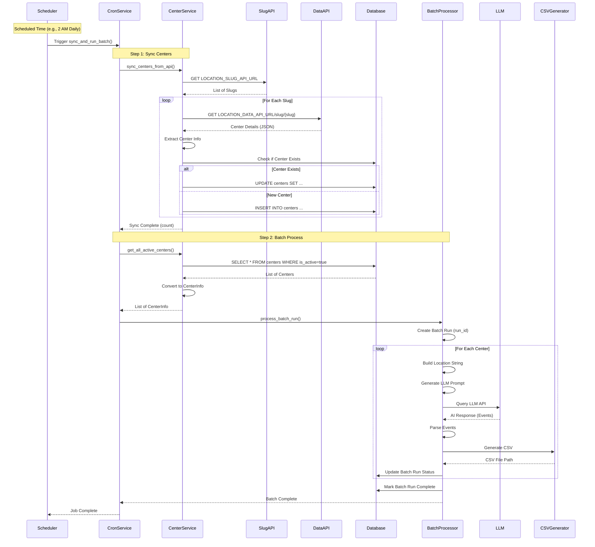
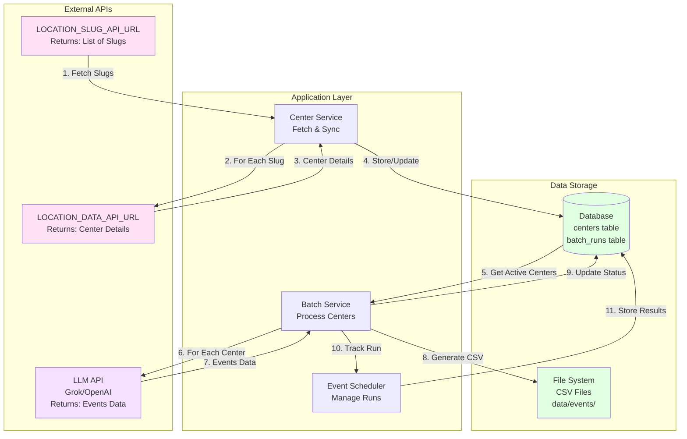
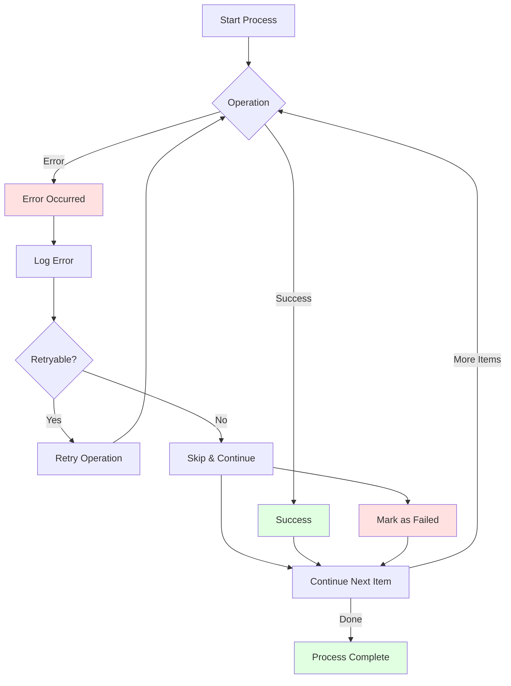

# Automation Flow Diagram - Center Sync & Batch Processing System

## Complete System Architecture

```mermaid
graph TB
    subgraph "Configuration & Startup"
        ENV[Environment Variables<br/>LOCATION_SLUG_API_URL<br/>LOCATION_DATA_API_URL<br/>CRON_ENABLED<br/>CRON_SCHEDULE]
        APP[FastAPI Application<br/>Startup]
        DB_INIT[Database Initialization<br/>Create Tables]
        CRON_INIT[Cron Service Initialization]
    end

    subgraph "Automated Flow (Cron Job)"
        CRON_TRIGGER[Cron Scheduler<br/>Triggers at Scheduled Time<br/>Default: Daily 2 AM]
        SYNC_START[Start Center Sync Process]
    end

    subgraph "Manual Triggers (API Endpoints)"
        MANUAL_SYNC[POST /cron/sync-centers]
        MANUAL_BATCH[POST /cron/run-batch]
        MANUAL_FULL[POST /cron/sync-and-run]
    end

    subgraph "Step 1: Fetch Center Slugs"
        API_SLUG[Call LOCATION_SLUG_API_URL<br/>GET Request]
        PARSE_SLUGS[Parse Response<br/>Extract Slugs List]
        SLUGS_LIST[List of Center Slugs]
    end

    subgraph "Step 2: Fetch Center Details"
        FOR_EACH[For Each Slug]
        API_DETAILS[Call LOCATION_DATA_API_URL<br/>GET /slug/{slug}]
        PARSE_DETAILS[Parse Location Data<br/>Extract Center Info]
        CENTER_DATA[Center Information<br/>- center_id<br/>- center_name<br/>- city, state, zip<br/>- owner_email<br/>- radius]
    end

    subgraph "Step 3: Database Operations"
        CHECK_DB{Center Exists<br/>in Database?}
        UPDATE_CENTER[Update Existing Center<br/>Update Fields<br/>Set updated_at]
        CREATE_CENTER[Create New Center<br/>Insert Record]
        COMMIT[Commit Transaction]
        DB[(SQLite/PostgreSQL<br/>Database<br/>centers table)]
    end

    subgraph "Step 4: Batch Process Preparation"
        GET_ACTIVE[Get All Active Centers<br/>from Database]
        CONVERT[Convert to CenterInfo<br/>Format]
        CENTER_INFOS[List of CenterInfo<br/>Objects]
    end

    subgraph "Step 5: Batch Event Discovery"
        CREATE_RUN[Create Batch Run<br/>Generate run_id]
        BATCH_RUN[Batch Run Created<br/>Status: running]
        FOR_EACH_CENTER[For Each Center]
    end

    subgraph "Step 6: Event Discovery Process"
        BUILD_LOCATION[Build Location String<br/>zip, city, state]
        GEN_PROMPT[Generate LLM Prompt<br/>Using Template]
        CALL_LLM[Call LLM API<br/>Grok/OpenAI]
        PARSE_EVENTS[Parse AI Response<br/>Extract Events]
        GEN_CSV[Generate CSV File<br/>Save to data/events/]
        EVENT_RESULT[Event Discovery Result<br/>- events found<br/>- csv_path<br/>- status]
    end

    subgraph "Step 7: Batch Completion"
        UPDATE_STATUS[Update Batch Run Status<br/>- processed_centers<br/>- successful_centers<br/>- failed_centers]
        STORE_RESULTS[Store Results in Database<br/>batch_runs table]
        COMPLETE[Batch Run Complete<br/>Status: completed]
    end

    subgraph "Monitoring & Status"
        STATUS_API[GET /cron/status<br/>Check Cron Status]
        BATCH_STATUS[GET /events/status/{run_id}<br/>Check Batch Status]
    end

    %% Startup Flow
    ENV --> APP
    APP --> DB_INIT
    APP --> CRON_INIT
    CRON_INIT --> CRON_TRIGGER

    %% Automated Flow
    CRON_TRIGGER --> SYNC_START

    %% Manual Triggers
    MANUAL_SYNC --> SYNC_START
    MANUAL_FULL --> SYNC_START
    MANUAL_BATCH --> GET_ACTIVE

    %% Sync Process
    SYNC_START --> API_SLUG
    API_SLUG --> PARSE_SLUGS
    PARSE_SLUGS --> SLUGS_LIST
    SLUGS_LIST --> FOR_EACH
    FOR_EACH --> API_DETAILS
    API_DETAILS --> PARSE_DETAILS
    PARSE_DETAILS --> CENTER_DATA
    CENTER_DATA --> CHECK_DB
    CHECK_DB -->|Exists| UPDATE_CENTER
    CHECK_DB -->|New| CREATE_CENTER
    UPDATE_CENTER --> COMMIT
    CREATE_CENTER --> COMMIT
    COMMIT --> DB

    %% Batch Process
    DB --> GET_ACTIVE
    GET_ACTIVE --> CONVERT
    CONVERT --> CENTER_INFOS
    CENTER_INFOS --> CREATE_RUN
    CREATE_RUN --> BATCH_RUN
    BATCH_RUN --> FOR_EACH_CENTER

    %% Event Discovery
    FOR_EACH_CENTER --> BUILD_LOCATION
    BUILD_LOCATION --> GEN_PROMPT
    GEN_PROMPT --> CALL_LLM
    CALL_LLM --> PARSE_EVENTS
    PARSE_EVENTS --> GEN_CSV
    GEN_CSV --> EVENT_RESULT
    EVENT_RESULT --> UPDATE_STATUS

    %% Completion
    UPDATE_STATUS --> STORE_RESULTS
    STORE_RESULTS --> COMPLETE
    COMPLETE --> DB

    %% Monitoring
    STATUS_API -.-> CRON_INIT
    BATCH_STATUS -.-> STORE_RESULTS

    style CRON_TRIGGER fill:#e1f5ff
    style SYNC_START fill:#fff4e1
    style API_SLUG fill:#ffe1f5
    style API_DETAILS fill:#ffe1f5
    style DB fill:#e1ffe1
    style CALL_LLM fill:#f5e1ff
    style COMPLETE fill:#e1ffe1
```

## Detailed Component Flow

### 1. System Initialization Flow



### 2. Automated Cron Job Flow



### 3. Manual API Endpoints Flow

```mermaid
graph LR
    subgraph "Manual Endpoints"
        EP1[POST /cron/sync-centers<br/>Sync Only]
        EP2[POST /cron/run-batch<br/>Batch Only]
        EP3[POST /cron/sync-and-run<br/>Full Process]
        EP4[GET /cron/status<br/>Check Status]
        EP5[GET /events/status/{run_id}<br/>Batch Status]
    end

    subgraph "Operations"
        OP1[Sync Centers<br/>from APIs]
        OP2[Run Batch<br/>for Active Centers]
        OP3[Sync + Batch<br/>Complete Flow]
        OP4[Return Cron<br/>Service Status]
        OP5[Return Batch<br/>Run Details]
    end

    EP1 --> OP1
    EP2 --> OP2
    EP3 --> OP3
    EP4 --> OP4
    EP5 --> OP5

    style EP1 fill:#e1f5ff
    style EP2 fill:#e1f5ff
    style EP3 fill:#e1f5ff
    style EP4 fill:#fff4e1
    style EP5 fill:#fff4e1
```

### 4. Data Flow Diagram



## Key Components Breakdown

### 1. **Cron Scheduler**
- **Technology**: APScheduler (AsyncIOScheduler)
- **Schedule**: Configurable via `CRON_SCHEDULE` (default: `0 2 * * *`)
- **Function**: Automatically triggers sync and batch process at scheduled times
- **Status**: Can be enabled/disabled via `CRON_ENABLED`

### 2. **Center Sync Service**
- **Step 1**: Fetch all slugs from `LOCATION_SLUG_API_URL`
- **Step 2**: For each slug, fetch details from `LOCATION_DATA_API_URL`
- **Step 3**: Extract and normalize center information
- **Step 4**: Store/update in database

### 3. **Database Layer**
- **Tables**:
  - `centers`: Stores center information
  - `batch_runs`: Tracks batch run history
- **Operations**: Create, Read, Update (CRUD operations)
- **Persistence**: SQLite (default) or PostgreSQL

### 4. **Batch Processing**
- **Input**: List of active centers from database
- **Process**: For each center:
  - Generate location string
  - Create LLM prompt
  - Call LLM API
  - Parse events
  - Generate CSV
- **Output**: CSV files + database records

### 5. **API Endpoints**
- **Automated**: Cron job runs automatically
- **Manual**: REST endpoints for on-demand execution
- **Monitoring**: Status endpoints for tracking

## Execution Timeline Example

```
00:00:00 - Application Starts
00:00:01 - Database Initialized
00:00:02 - Cron Service Started
00:00:03 - Next Run Scheduled: 02:00:00

... (Application Running) ...

02:00:00 - Cron Triggered
02:00:01 - Fetching Center Slugs (API Call 1)
02:00:03 - Received 25 Slugs
02:00:04 - Fetching Details for Slug 1 (API Call 2)
02:00:05 - Fetching Details for Slug 2 (API Call 3)
...
02:01:30 - All Centers Synced (25 centers)
02:01:31 - Starting Batch Run
02:01:32 - Processing Center 1 (LLM Call 1)
02:02:15 - Processing Center 2 (LLM Call 2)
...
02:45:00 - Batch Run Complete (25 centers processed)
02:45:01 - Next Run Scheduled: 02:00:00 (next day)
```

## Error Handling Flow



## Configuration Matrix

| Component | Configuration | Default | Description |
|-----------|--------------|---------|-------------|
| Cron Schedule | `CRON_SCHEDULE` | `0 2 * * *` | Daily at 2 AM |
| Cron Enabled | `CRON_ENABLED` | `true` | Enable/disable cron |
| Slug API | `LOCATION_SLUG_API_URL` | - | Required |
| Data API | `LOCATION_DATA_API_URL` | - | Required |
| API Key | `LOCATION_API_KEY` | - | Optional |
| Database | `DATABASE_URL` | `sqlite:///stage.db` | Database connection |

## Benefits of This Architecture

1. **Automated**: Runs on schedule without manual intervention
2. **Manual Override**: Can trigger manually via API endpoints
3. **Resilient**: Error handling and retry logic
4. **Trackable**: All runs stored in database
5. **Scalable**: Can handle multiple centers efficiently
6. **Monitorable**: Status endpoints for tracking progress

